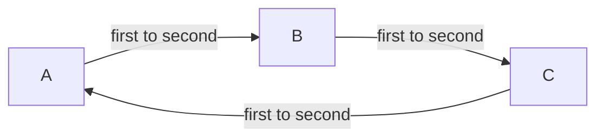

## Composition of bi-coupling schemes

preCICE allows us to combine multiple coupling schemes by only specifying them one after the other in the configuration:

```xml
<coupling-scheme:parallel-explicit>
  <participants first="A" second="B"/>
  ...
</coupling-scheme:parallel-explicit>
<coupling-scheme:parallel-explicit>
  <participants first="C" second="A"/>
  ...
</coupling-scheme:parallel-explicit>
```

For this example, all three participants are executed in parallel to one another, whereas `A` exchanges data with `B` and `C`, but not the latter two with each other.

Numerically, it only makes sense to either only have explicit schemes or to combine one implicit scheme with several explicit ones. Combining two implicit schemes is forbidden. To find out more, you can read [this paper](https://doi.org/10.1007/s00466-014-1113-2). If you want to resolve more than one strong interaction, you need a [fully-implicit multi-coupling](configuration-coupling-multi.html#fully-implicit-multi-coupling).

Still, even with only explicit schemes, you can do very strange combinations. Some of them will not work, but run into a deadlock. To better understand this, let us modify the example slightly: We add an interaction between `B` and `C` and switch to serial coupling schemes everywhere.

```xml
<coupling-scheme:serial-explicit>
    <participants first="A" second="B" />
    ...
    <exchange data="AB-Data" mesh="..." from="A" to="B" />
  </coupling-scheme:serial-explicit>

  <coupling-scheme:serial-explicit>
    <participants first="B" second="C" />
    ...
    <exchange data="BC-Data" mesh="..." from="B" to="C" />
  </coupling-scheme:serial-explicit>

  <coupling-scheme:serial-explicit>
    <participants first="C" second="A" />
    ...
    <exchange data="CA-Data" mesh="..." from="C" to="A" />
  </coupling-scheme:serial-explicit>
```

The mesh over which the data is communicated plays no role. We get a circular dependency:



All three participants are a second participant in a serial coupling scheme, in which they receive data. Thus, they all wait for data in `initialize`, which is, however, only sent in the `advance` call of another participant, as explained on the [coupling flow pages](couple-your-code-coupling-flow.html).

There are two easy fixes here: Either switch to parallel coupling scheme somewhere (better everywhere, otherwise you could still screw up the situation) or swap `first` and `second` in any of the coupling schemes. For example in the last coupling scheme:

```diff
- <participants first="C" second="A" />
+ <participants first="A" second="C" />
```

This exact setup is tested in the [circular integration test](https://github.com/precice/precice/blob/develop/tests/serial/circular/Explicit.xml). 

Want to read more? Have a look at a [blog post on compositional coupling](https://precice.discourse.group/t/a-look-at-compositional-coupling-and-the-hotfix-v3-1-2/1992).

## Fully-implicit multi-coupling

In a fully-implicit multi-coupling, an arbitrary number of solvers are executed in parallel to each other in an implicit fashion.

```xml
<coupling-scheme:multi>
  <participant name="A" control="yes"/>
  <participant name="B" />
  <participant name="C" />
  ...
</coupling-scheme:multi>
```

Exactly one participant needs to take `control` of the coupling. preCICE computes the convergence measures and the acceleration on this participant.


Prior to version 2.3.0, this controlling participant needs to be centric.
This means that it requrires `m2n` connections to all other participants and the `exchange` tags needs to be properly configured.
Version 2.3.0 allows non-centric participants as long as they run in serial.


Data being exchanged between multiple solvers must be configured indentically in terms of data initialization and substeps.
All other tags are similar to a normal [implicit coupling](configuration-coupling.html#implicit-coupling-schemes).

To find out more about multi coupling, you can also read Section 3.8 in [Benjamin's thesis](https://mediatum.ub.tum.de/doc/1320661/document.pdf) or have a look at the [tutorial of multiple perpendicular flaps in a channel](tutorials-multiple-perpendicular-flaps.html).
